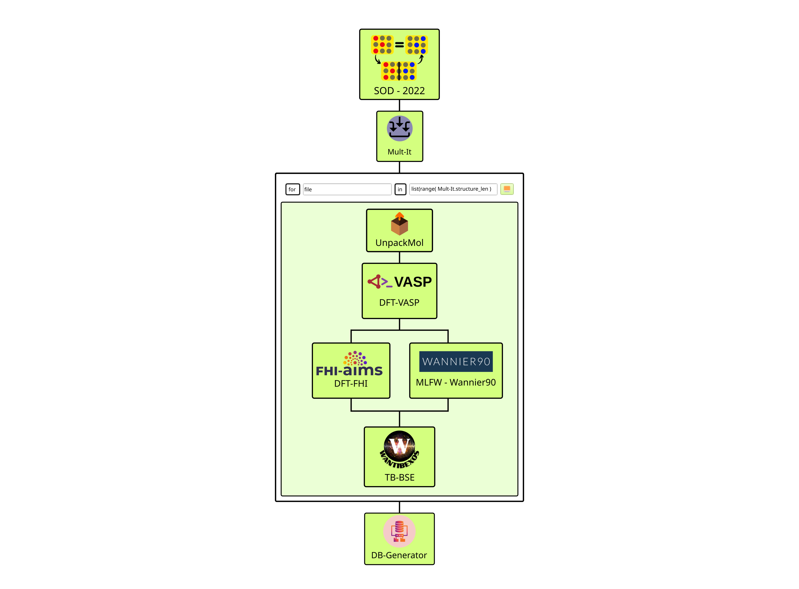

# TMD-Alloy
Transition Metal Dicalcogenite, Alloys, Density functional theory, GQCA

# Colab

- Colab notebook for data visualization .

This notebook is used to compute the thermodynamic properties and statistical attributes from the ab initio calculations executed from the TMD-Alloy Workflow. Below, we describe the functions covered by the actual version.

```python
def root_lagrange_multiplier(x, T):
   """
Parameters:
        x (float): The composition of alloy, such as 0<=x<=1.
        T (float): Temperature in Kelvin.
Returns:
        eta (float): The value of Lagrange multiplier.
    """'
```

This function calculate the value of Lagrange multiplier η, which is related to the average composition constrain evaluated as x at temperature T.

```python
def xj(self, j, T, eta):
 """
    Calculates the Cluster probabilities for each class in GQCA.

    Parameters:
        j (int): number of class, in the same order of the input file gqca_inputs.yml.
        T (float): Temperature in Kelvin.
        eta (float): The value of Lagrange multiplier within GQCA.
    Returns:
        xj (float): The value of cluster probability for the j-th class of alloy.
    """
```

The function xj compute the cluster probabilities associated with the class j, at temperature T, in which the η value calculated by the function root_lagrange_multiplier(x, T) enters as a parameter to ensure the composition constrain.

```python
def xj0(j, x):

    """
    Calculates the Cluster probabilities associated with a regular solution.

    Parameters:
        j (int): number of class, in the same order of the input file gqca_inputs.yml.
        x (float): The composition of alloy, such as 0<=x<=1.
    Returns:
        xj0 (float): The value of cluster probability in the limit of a regular solution for the j-th class of alloy.
    """
```

This function returns the cluster probabilities associated with a regular solution xj0 for class j, when the alloy has composition fixed at x.

```python
def emix(x, T):
 """
    Calculates the mixing energy for the alloy at a given composition and temperature.

    Parameters:
        x (float): The composition of alloy, such as 0<=x<=1.
        T (float): Temperature in Kelvin.
    Returns:
        emix (float): The value of mixing energy for the alloy at composition x and temperature T.
    """
```

The function emix is used to calculate the mixing energy of the alloy with average compostion x at temperature T.

```python
def smix(x, T):
    """
    Calculates the mixing entropy for the alloy at a given composition and temperature.

    Parameters:
        x (float): The composition of alloy, such as 0<=x<=1.
        T (float): Temperature in Kelvin.
    Returns:
        smix (float): The value of mixing entropy for the alloy at composition x and temperature T.
    """
```


The function smix(x, T) is used to calculate the the mixing entropy, according to the GQCA expression. Its input arguments are the average composition x and the temperature T (in Kelvin).

```python
def fmix(x, T):

    """
    Calculates the mixing Helmholtz free energy for the alloy at a given composition and temperature.

    Parameters:
        x (float): The composition of alloy, such as 0<=x<=1.
        T (float): Temperature in Kelvin.
    Returns:
        fmix (float): The value of mixing Helmholtz free energy for the alloy at composition x and temperature T.
    """
```

This function sum the contributions from emix and smix to return the mixing free energy of alloy, calculated at average composition x and temperature T.

```python
  def kld(x, T):
    """
    Calculates the Kullback-Leibler Divergence D_{KL}(xj||xj0) between the xj and xj0 probability distributions.

    Parameters:
        x (float): The composition of alloy, such as 0<=x<=1.
        T (float): Temperature in Kelvin.
    Returns:
        dkl (float): The value of Kullback-Leibler Divergence at composition x and temperature T.
    """
```

The function kld returns the Kullback-Leibler divergence between the probabilities distributions computed from xj and xj0 functions explained above. It uses both functions, employing as input parameters the average compostion of alloy and its temperature T in Kelvin.

```python
def second_derivative(self, x, T):

    """
    Calculates the second derivative of the Helmholtz free energy using finite differences

    Parameters:
        x (float): The composition of alloy, such as 0<=x<=1.
        T (float): Temperature in Kelvin.
    Returns:
        d2fmix/dx2 (float): The second derivative at composition x and temperature T.
    """
```

# TMD-Alloys Workflow

In this workflow, the SimStack framework generates configurations to analyze the thermodynamic properties of binary alloys within the Generalized Quasichemical Approximation (GQCA). For this, five different WaNos are combined: SOD-2022, Mult-It, UnpackMol, DFT-VASP, Wannier90, WanTIBEXOS, FHI-Aims, and Table-Generator. A table containing the clusters' total energies, degeneracy factors, and several site substitutions is the expected output of this protocol.

To create the workflow depicted in Figure 1, you must use the drag-and-drop standard procedure of Simstack in eight steps.  




## 1. Python Setup
To get this workflow up and running on your available computational resources, install the below libraries on Python 3.6 or newer.
```python
1. Atomic Simulation Environment (ASE).
2. Python Materials Genomics (Pymatgen).
3. Numpy, os, sys, re, yaml, subprocess.
4. json, csv, shutil, tarfile. 
```
## 2. SOD-2022 Inputs
- INSOD file, containing system definition, supercell size, number of substitutions, and specie replacements, as explained in Site Occupation Disorder (SOD) [software manual](https://github.com/gcmt-group/sod).
- SGO file containing the matrix-vector representations of the symmetry operators associated with the space group of the parent structure associated with the alloy. You can create this file using the [Bilbao Crystallographic Server](https://www.cryst.ehu.es/). As explained in [SOD manual](https://github.com/gcmt-group/sod), the first three numbers in each line are one row of the operator matrix, and the fourth number is the component of the operator translation vector.
  
## 3. SOD-2022 Output
All information to the next WaNo will be contained in the `calcs.tar` file.


## 4. Mult-It Inputs
## 5. Mult-It Outputs
## 6. UnpackMol Inputs
## 7. UnpackMol Outputs
## 8. DFT-VASP Inputs
## 9. DFT-VASP Outputs
## 10. DFT-FHI Inputs
## 11. DFT-FHI Outputs
## 12. MLWF-Wannier90 Inputs
## 13. MLWF-Wannier90 Outputs
## 14. WanTIBEXOS Inputs
## 15. WanTIBEXOS Outputs
## 16. Table-Generator Inputs
## 17. Table-Generator Outputs

# Acknowledgements
Developer: Celso Ricardo C. Rêgo, Multiscale Materials Modelling and Virtual Design, Institute of Nanotechnology, Karlsruhe Institute of Technology [https://www.int.kit.edu/wenzel.php](https://www.int.kit.edu/wenzel.php).
# License & Copyright
