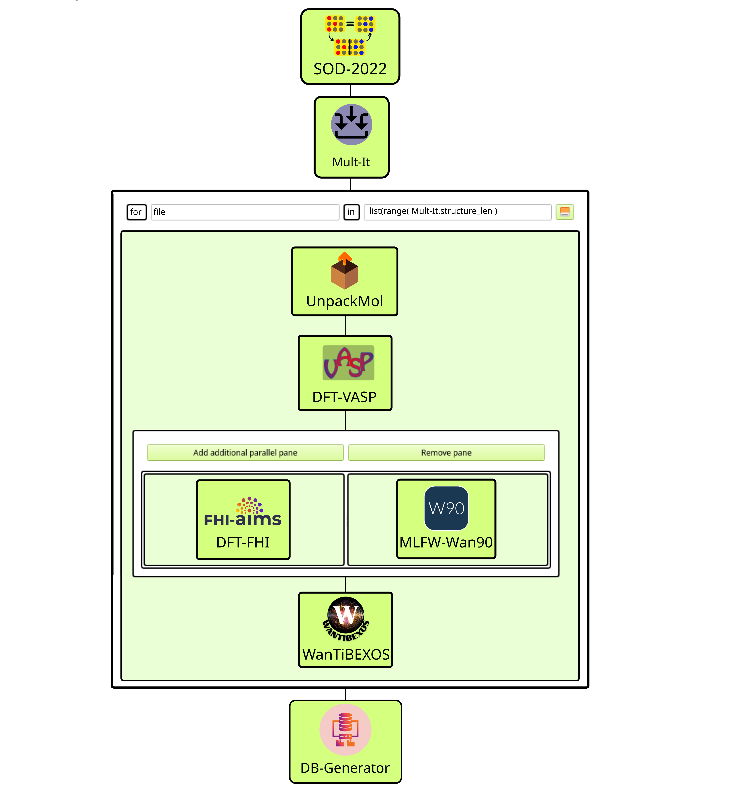

# TMD-Alloy
Transition Metal Dicalcogenite, Alloys, Density functional theory, GQCA

# Colab

- Colab notebook for data visualization [](https://colab.research.google.com/drive/1Bz39pi6LZct-AGXewyKuhHlPpkbgiuYF#scrollTo=O1wf4JJ_l3Gk).

This notebook is used to compute the thermodynamic properties and statistical attributes from the ab initio calculations executed from the TMD-Alloy Workflow. Below, we describe the functions covered by the actual version.

```python
def root_lagrange_multiplier(x, T):
   """
Parameters:
        x (float): The composition of alloy, such as 0<=x<=1.
        T (float): Temperature in Kelvin.
Returns:
        eta (float): The value of Lagrange multiplier.
    """'
```

This function calculate the value of Lagrange multiplier η, which is related to the average composition constrain evaluated as x at temperature T.

```python
def xj(self, j, T, eta):
 """
    Calculates the Cluster probabilities for each class in GQCA.

    Parameters:
        j (int): number of class, in the same order of the input file gqca_inputs.yml.
        T (float): Temperature in Kelvin.
        eta (float): The value of Lagrange multiplier within GQCA.
    Returns:
        xj (float): The value of cluster probability for the j-th class of alloy.
    """
```

The function xj compute the cluster probabilities associated with the class j, at temperature T, in which the η value calculated by the function root_lagrange_multiplier(x, T) enters as a parameter to ensure the composition constrain.

```python
def xj0(j, x):

    """
    Calculates the Cluster probabilities associated with a regular solution.

    Parameters:
        j (int): number of class, in the same order of the input file gqca_inputs.yml.
        x (float): The composition of alloy, such as 0<=x<=1.
    Returns:
        xj0 (float): The value of cluster probability in the limit of a regular solution for the j-th class of alloy.
    """
```

This function returns the cluster probabilities associated with a regular solution xj0 for class j, when the alloy has composition fixed at x.

```python
def emix(x, T):
 """
    Calculates the mixing energy for the alloy at a given composition and temperature.

    Parameters:
        x (float): The composition of alloy, such as 0<=x<=1.
        T (float): Temperature in Kelvin.
    Returns:
        emix (float): The value of mixing energy for the alloy at composition x and temperature T.
    """
```

The function emix is used to calculate the mixing energy of the alloy with average compostion x at temperature T.

```python
def smix(x, T):
    """
    Calculates the mixing entropy for the alloy at a given composition and temperature.

    Parameters:
        x (float): The composition of alloy, such as 0<=x<=1.
        T (float): Temperature in Kelvin.
    Returns:
        smix (float): The value of mixing entropy for the alloy at composition x and temperature T.
    """
```


The function smix(x, T) is used to calculate the the mixing entropy, according to the GQCA expression. Its input arguments are the average composition x and the temperature T (in Kelvin).

```python
def fmix(x, T):

    """
    Calculates the mixing Helmholtz free energy for the alloy at a given composition and temperature.

    Parameters:
        x (float): The composition of alloy, such as 0<=x<=1.
        T (float): Temperature in Kelvin.
    Returns:
        fmix (float): The value of mixing Helmholtz free energy for the alloy at composition x and temperature T.
    """
```

This function sum the contributions from emix and smix to return the mixing free energy of alloy, calculated at average composition x and temperature T.

```python
  def kld(x, T):
    """
    Calculates the Kullback-Leibler Divergence D_{KL}(xj||xj0) between the xj and xj0 probability distributions.

    Parameters:
        x (float): The composition of alloy, such as 0<=x<=1.
        T (float): Temperature in Kelvin.
    Returns:
        dkl (float): The value of Kullback-Leibler Divergence at composition x and temperature T.
    """
```

The function kld returns the Kullback-Leibler divergence between the probabilities distributions computed from xj and xj0 functions explained above. It uses both functions, employing as input parameters the average compostion of alloy and its temperature T in Kelvin.

```python
def second_derivative(self, x, T):

    """
    Calculates the second derivative of the Helmholtz free energy using finite differences

    Parameters:
        x (float): The composition of alloy, such as 0<=x<=1.
        T (float): Temperature in Kelvin.
    Returns:
        d2fmix/dx2 (float): The second derivative at composition x and temperature T.
    """
```

# TMD-Alloys Workflow

In this workflow, the SimStack framework generates configurations to analyze the thermodynamic properties of binary alloys within the Generalized Quasichemical Approximation (GQCA). For this, five different WaNos are combined: SOD-2022, Mult-It, UnpackMol, DFT-VASP, Wannier90, WanTIBEXOS, FHI-Aims, and Table-Generator. A table containing the clusters' total energies, degeneracy factors, and several site substitutions is the expected output of this protocol.

To create the workflow depicted in Figure 1, you must use the drag-and-drop standard procedure of Simstack in eight steps.  


*Figura 1: Esta é a legenda da imagem.*

## 1. Python Setup

To get this workflow up and running on your available computational resources, install the below libraries on Python 3.6 or newer.
```python
1. Atomic Simulation Environment (ASE).
2. Python Materials Genomics (Pymatgen).
3. Numpy, os, sys, re, yaml, subprocess.
4. json, csv, shutil, tarfile. 
```

## 2. SOD-2022 Inputs

- INSOD file, containing system definition, supercell size, number of substitutions, and specie replacements, as explained in Site Occupation Disorder (SOD) [software manual](https://github.com/gcmt-group/sod).
- SGO file containing the matrix-vector representations of the symmetry operators associated with the space group of the parent structure associated with the alloy. You can create this file using the [Bilbao Crystallographic Server](https://www.cryst.ehu.es/). As explained in [SOD manual](https://github.com/gcmt-group/sod), the first three numbers in each line are one row of the operator matrix, and the fourth number is the component of the operator translation vector.
  
## 3. SOD-2022 Output

- All information to the next WaNo will be contained in the `calcs.tar` file.

## 4. Mult-It Inputs

- You need to check the box _Structures_.
- In the tarfile field, configure the path `SOD-2022/outputs/calcs.tar` if it is not properly configured.
  
## 5. Mult-It Outputs

- Configure the `file` name from the file command on the top of the AdvancedFor loop, as indicated in Figure 1.
- From the in command on the top of the loop, configure `list(range(Mult-It.struct_len))`.

## 6. UnpackMol Inputs

- Check the box Multivariable-mode.
- The input-file variable should be set as `Mult-It/outputs/structure_output_dict.yml`.
- Structures-int variable should be set as `${file}`.
- Structures variable should be set as `Mult-It/outputs/Structures.tar`.

## 7. UnpackMol Outputs

POSCAR files (named as Mol_geom.xyz) should be passed to DFT-VASP __WaNo__.

## 8. DFT-VASP Inputs

- __INCAR tab__: as an option, we can set all INCAR flags available within VASP. However, we expose only a few of them, which is essential for the problem. See the GUI of this WaNo. A brief description of each flag pops up when we hover the mouse over the inputs.
- __KPOINTS tab__: Here, the user can define two types of KPOINTS, `Kpoints_length` and `Kpoints_Monkhorst`.
- __Analysis tab__: Aimed to compute Bader charge analysis and DOS.
- __Files_Run tab__: Mandatory loads the POSCAR file, and as an option, can load INCAR, POTCAR, KPOINTS, and KORINGA files. The KORINGA file can be any file. In the case of this problem, it loads the Input_data.yml file. Poscar_file variable should be set as `AdvancedForEach/${file_ITER}/UnpackMol/outputs/Mol_geom.xyz`.

## 9. DFT-VASP Outputs

- OUTCAR file.

## 10. DFT-FHI Inputs

- __control.in__ file.
- __geometry.in__ file.

## 11. DFT-FHI Outputs

- bands.out file.

## 12. MLWF-Wannier90 Inputs

- __wannier90.win__ file.

## 13. MLWF-Wannier90 Outputs

- __wannier90.wout__ file.

## 14. WanTIBEXOS Inputs

- __input.dat__ file.
- __kpoint.dat__ file.
- __tb_hr.dat__ file.

## 15. WanTIBEXOS Outputs

- __output__ file.

## 16. Table-Generator Inputs

- OUTCAR file.

- __Imports tab__: Search_in_File variable should be set as vasp_results.yml and import this file using `AdvancedForEach/*/DFT-VASP/outputs/vasp_results.yml` command.
- Search_Parameters: Set the variables `total_energy` and `title`.

## 17. Table-Generator Outputs

- Table-dict.yml containing the variables defined in the Search_Parameters field above, as shown in __Figure 1__.

# Acknowledgements

# License & Copyright
Developer: Celso Ricardo C. Rêgo, Multiscale Materials Modelling and Virtual Design, Institute of Nanotechnology, Karlsruhe Institute of Technology [https://www.int.kit.edu/wenzel.php](https://www.int.kit.edu/wenzel.php).
